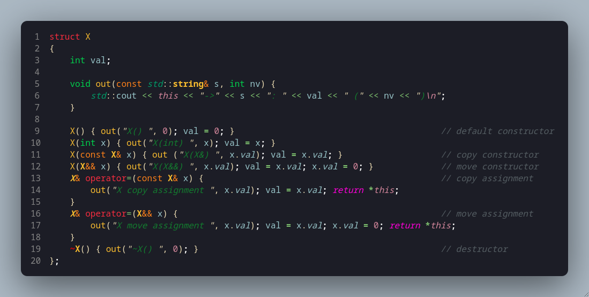

# Explanation of "Try This" on Page 742


+ **Line 3:** This is a value that will help us keep track of constructions/copies/movement/etc.

+ **Line 5:** This will print and provide the memory address, operations, current value and new value (in parentheses) for each operation.

+ **Line 9:** ```X() { /* code */ }``` is the **default constructor** -- it is 'default' because it is takes no parameters. If X is instantiated with only a name and no value, the default value of 0 will be assigned to int val. Example: ```X a;``` <-- an X object 'a' will be default constructed with int val = 0 and out() will print X().

+ **Line 10:** This is a constructor that takes an int type as a parameter. If X is instantiated with an int, ```X a(3)```, then an X object 'a' will be constructed with int val = 3 and out() will print X(int).

+ **Line 11:** ```X(const X& x)``` is a special constructor called a **copy constructor** that is called when X is instantiated with a pre-existing X object as a parameter. The X object to be copied is passed as a constant reference, thus ensuring the original object is unmodified and is passed directly (via reference) to the constructor without an additional (in this case a third(!)) copy being made. Example:
```cpp
X x1(3)     // First object
X x2{ x1 }; // x2 is copy constructed
```
In this code, out() will print X(X&), 0 (the current value of this), x.val's int value in parantheses (this will be repeated the all out() prints). The val of ```this``` (the object being constructed) will be assigned the value of x's val.

+ **Line 12:** ```X(X&& x)``` is a special constructor called a **move constructor** that is called when: a temporary X object (rvalue [such as an X object being created then returned by a function]) or an object explicitly moved with std::move() is used to construct to a new X object. The `&&` notation is called **rvalue reference** -- so named because historically it denoted the value on the right side of an assignment. Example:
```cpp
X function(int n) 
{
    X temp(n);
    temp.val += 1;
    return temp;
}
int main()
{
    X local_x{ function(4) };
    // local_x.val will be 5
}
```
The move constructor will move val from 'temp' directly to local_x as opposed to creating a complete X object temp, then copy temp to local_x, then delete temp. Instead of creating the unnecessary copy of temp, it 'moves' the values of temp to the caller (in this case local_x). While seemingly not a heavy operation in this example, the same would be applied to (for example) a vector of 100 elements of >16 character strings where the consequences of an unnecessary copy are more severe.
> **_Note =>_** Modern compilers (mine included: Clang 20.1.7) often apply **Return Value Optimization (RVO)** and can "eliminate the move constructor call entirely and instead construct the object directly in the caller's memory".

In our code, this constructor will have out() print X(X&&), set val (of ```this`) to x's val, then set x's val to zero after moving is complete (preparing it for deletion).

+ **Line 13:** ```X& operator=(const X& x)``` is the **copy assignment operator**. It is an overload of the assignment operator that is called when assigning an existing object to another already existing object. For example:
```cpp
X object1(3);
X object2(5);
object1 = object2;    // object 2 is copied to object 1, thus object2.val = 5
```
It differs from a regular copy constructor by the pre-existence of the class object that is being copied-to. Also, this is the first of our essential operations that takes a reference to the class type (X&) and returns a dereferenced ```this```. This allows for assignment chaining (as all built-in types allow), for example: ```xObject1 = xObject2 = xObject3 = X{ 5 };```. Also, returning by reference avoids creating temporary (unnecessary) copies as would be done if the copy assignment operator returned by value. In our code, out() prints "X copy assignment", the current value of ```this``` (which in this case may be non-zero since it is a pre-existing object!) and the new value being assigned to it.

+ **Line 16:** ```X& operator=(X&& x)``` is the **move assignment operator**. It is an overload of the assignment operator that is called when assigning an **ravlue** (temporary object or object wrapped in std::move()) to an **already existing** object. For example:
    ```cpp
    // Using X function(int n) from move constructor example
    int main()
    {
        X object3(5);
        object3 = function(6);    // Excluding RVO, this will call the move assignment operator because object3 already exists
    }
    ```
     ...or...
    ```cpp
    int main()
    {
        X object3(5);
        X object4(6);
        X object4 = std::move(object3);
    }
    ```
The main difference between a move constructor and a move assignment operator is -- obviously -- the syntax but also the ability to chain assignment by virtue of the move assignment operator returning a dereferenced ```this```. 

+ **Line 19:** ```~X()``` is (finally!) the **destructor**. It is called at the end of an object's lifecycle, most commonly: either when an object goes out of scope or when an object is deleted with keyword ```delete```. For example:
```cpp
void function(int n)
{
    X temp{ n };
} // <-- destructor is called for temp here

X global{ 2 };

int main()
{
    X* xPtr = new X(5); 
    delete xPtr; // <-- destructor is called for xPtr here

    return 0; // <-- destructor is called for global here
}
```
Though not implemented in the code we are working with here, the destructor must release any resources that class objects obtain through their lifetime. If val was initialized on the heap, the destructor must include ```delete val;```, or if we have an Image object that opens an image file in its initialization, it must close that file stream in its destructor.