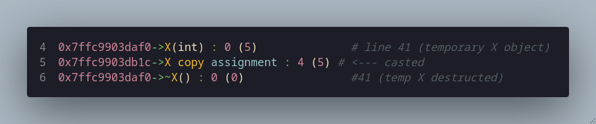

# Explanation of "Try This" on Page 742


+ **Line 8:** This is a value that will help us keep track of constructions/copies/movement/etc.

+ **Line 10:** ```out()``` will print and provide the memory address, operation being called, current value and new value (in parentheses).

+ **Line 14:** ```X()``` is the **default constructor** -- it is 'default' because it is takes no parameters. If X is instantiated with only a name and no value, the default value of 0 will be assigned to int val. Example: ```X a;``` <-- an X object 'a' will be default constructed with int val = 0 and out() will print X().

+ **Line 15:** ```X(int x)``` is a constructor that takes an int type as a parameter. If X is instantiated with an int, ```X a(3)```, then an X object 'a' will be constructed with int val = 3 and out() will print X(int). This constructor could also be re-written (perhaps more idiomatically) with member-initialization like so:
```cpp
X(int x) : val{ x } { out("X(int) ", x); }
```

+ **Line 16:** ```X(const X& x)``` is a special constructor called a **copy constructor** that is called when X is instantiated with a pre-existing X object as a parameter. The X object to be copied is passed as a constant reference, thus ensuring the original object is unmodified and is passed directly (via reference) to the constructor without an additional (in this case a third(!)) copy being made. Example:
```cpp
X x1(3)     // First object
X x2{ x1 }; // x2 is copy constructed
```
In this code, out() will print X(X&), 0 (the current value of this), x.val's int value in parantheses (this will be repeated the all out() prints). The val of ```this``` (the object being constructed) will be assigned the value of x's val.
> **_Note_ =>** The copy _constructor_ is called for **new** objects. If (from our example) x2 already existed, then the copy _assignment operator_ would be called instead. Note also that in that case initialization brackets would fail to compile for a pre-existing object and the ```=``` operator would have to be used. This is a benefit of using initialization brackets because they are unambiguous, whereas ```=``` can be used for both, initialization and assignment (explained again below). For example:
```cpp
X x1(3);
X x2{ x1 };     // initialized, copy constructed
X x3 = x2;      // initialized, copy constructed
x1 = x3;        // assignment, copy assignment operator
```

+ **Line 17:** ```X(X&& x)``` is a special constructor called a **move constructor** that is called when: a temporary X object (rvalue [such as an X object being created then returned by a function]) or an object explicitly moved with std::move() is used to construct to a new X object. The `&&` notation is called **rvalue reference** -- so named because historically it denoted the value on the right side of an assignment. Example:
```cpp
X function(int n) 
{
    X temp(n);
    temp.val += 1;
    return temp;
}
int main()
{
    X local_x{ function(4) };
    // local_x.val will be 5
}
```
> **_Note =>_** Modern compilers (mine included: Clang 20.1.7) often apply **Return Value Optimization (RVO)** and can "eliminate the move constructor call entirely and instead construct the object directly in the caller's memory".

The move constructor will move val from 'temp' directly to local_x as opposed to creating a complete X object temp, then copy temp to local_x, then delete temp. Instead of creating the unnecessary copy of temp, it 'moves' the values of temp to the caller (in this case local_x). While seemingly not a heavy operation in this example, the same would be applied to (for example) a vector of 100 elements of >16 character strings where the consequences of an unnecessary copy are more severe.
> **_Also!_** The move constructor (and the move assignment operator below) put the moved-from object into a "valid but unspecified state" when it sets that object to the default value of 0. The moved-from object is thus ready for destruction but can also be re-used -- it should not, however, be read from (in our code it will simply print zero but in other code it could perhaps be a nullptr or false value, etc.).

In our code, this constructor will have out() print X(X&&), set val (of ```this`) to x's val, then set x's val to zero after moving is complete (preparing it for deletion).

+ **Line 18:** ```X& operator=(const X& x)``` is the **copy assignment operator**. It is an overload of the assignment operator that is called when assigning an existing object to another already existing object. For example:
```cpp
X object1(3);
X object2(5);
object1 = object2;    // object 2 is copied to object 1, thus object2.val = 5
```
It differs from a regular copy constructor by the pre-existence of the class object that is being copied-to. Also, this is the first of our essential operations that takes a reference to the class type (X&) and returns a dereferenced ```this```. This allows for assignment chaining (as all built-in types allow), for example: ```xObject1 = xObject2 = xObject3 = X{ 5 };```. Also, returning by reference avoids creating temporary (unnecessary) copies as would be done if the copy assignment operator returned by value. In our code, out() prints "X copy assignment", the current value of ```this``` (which in this case may be non-zero since it is a pre-existing object!) and the new value being assigned to it.

+ **Line 21:** ```X& operator=(X&& x)``` is the **move assignment operator**. It is an overload of the assignment operator that is called when assigning an **rvalue** (temporary object or object wrapped in std::move()) to an **already existing** object. For example:
    ```cpp
    // Using X function(int n) from move constructor example
    int main()
    {
        X object3(5);
        object3 = function(6);    // Excluding RVO, this will call the move assignment operator because object3 already exists
    }
    ```
     ...or...
    ```cpp
    int main()
    {
        X object3(5);
        X object4(6);
        object4 = std::move(object3);
    }
    ```
The main difference between a move constructor and a move assignment operator is -- obviously -- the syntax but also the ability to chain assignment by virtue of the move assignment operator returning a dereferenced ```this```. 
> **_Note =>_** Construction (initialization) and assignment can both use the ```=``` syntax and can be a source of confusion. If the object is being _instantiated_ (that is, it does **not** already exist) then the ```=``` is initialization syntax and a **constructor** (either copy or move) will be called. If the object _already exists_ and is being modified, then the ```=``` is assignment syntax and an assignment operator (either copy or move) will be called. 

+ **Line 24:** ```~X()``` is (finally!) the **destructor**. It is called at the end of an object's lifecycle: local objects are destroyed when their scope ends; temporary objects are destroyed at the end of their full expression; dynamic objects are destroyed when ```delete``` is called; and static/global objects are destroyed during at the end of the program (termination). For example:
```cpp
void function(int n)
{
    X temporary{ n };
} // <-- destructor is called for temporary here

X global{ 2 };

int main()
{
    X* dynamic = new X(5); 
    delete dynamic; // <-- destructor is called for xPtr here

    for (int i = 0; i < 3; ++i)
    {
        X local(i);
    } // <-- destructor is called for local here

    return 0; // <-- destructor is called for global here
}
```
Though not implemented in the code we are working with here, the destructor must release any resources that class objects obtain through their lifetime. If val was initialized on the heap, the destructor must include ```delete val;```, or if we have an Image object that opens an image file in its initialization, it must close that file stream in its destructor.

---


+ **Line 27:** This instantiates a global X object and initializes it with int value 2 therefore calling the int constructor from line 15. The corresponding line of output is here: 
  
  
+ **Line 29:** This defines a global/free function ```copy()``` that accepts an X object, creating a copy of it (pass-by-value), and then returns that same copy (return-by-value). Since we have defined a copy constructor on line 16, that constructor is invoked in the creation of the copied object in this function.
+ **Line 30:** A global/free function is like the line above it (pass-by-value), however here a temporary X object ```aa``` is instantiated and copy constructed from ```a``` then that temporary object is returned. Because the returned object is temporary, the compiler will call either the _move constructor_ if this function is used to initialize a new object, or the _move assignment operator_ if this function is used to set the value of a pre-existing X object in main().
+ **Line 31:** A global/free function that is pass- and return-by-reference. ```a``` must be a pre-existing X object and it is passed to this function by reference (a copy is not made); this function will return a reference to that same object. The returned reference can be used anywhere a reference to the original object would be valid. Thus, this function could be used in the following ways (note that since this functions returns a reference, this function can be used as an lvalue with an assignment operator):
```cpp
int main()
{
    X object1{ 5 };
    X& obj1Ref = ref_to(object1);
    obj1Ref.val += 1;

    X object2{ 3 };
    ref_to(object2) = object1;  // will call copy assignment operator, object2.val will now = 6

    ref_to(object1).member_function();  // pretend we have some member_function in our example

    int local_val = ref_to(object2).val;    // local_val will = 6
}
```
+ **Line 32:** ```make()``` is a global/free function that: 
  1. accepts an int parameter ```i``` (pass-by-value), 
  2. creates a local X object named ```a``` initialized with ```i``` using the int constructor from line 15, 
  3. then copy-constructs (line 16) a new heap-allocated X object from that temporary object, and finally 
  4. returns a pointer to that new X object.

This function allows us to make new X objects like so: ```X* object1 = make(4);``` rather than ```X* object1 = new X(4);```. While seemingly verbose for our simple X struct with a single int data member, such a function can prove useful with more complex classes where we want more control or instructions when creating heap-allocated objects (such as incrementing a global counter of heap objects). 

+ **Line 34:** Just a simple struct with two X objects as members. If an XX object is instantiated, members ```a``` and ```b``` will be default constructed (line 14).
---


### For this section, I will include snippets of the output that correspond to the lines of code **_after_** they are explained. The output lines will be commented to show which lines they correspond to. The complete output is available at the end of the document. 
#### Note that this output is from a release compilation with -O2 and -DNDEBUG flags and may vary with other -O levels and will very most likely vary if debug compiled. And, of course, the output might vary if compiled with a different compiler (I'm using Clang 20).

+ **Line 38:** This instantiates a local (stack-allocated) X object named ```loc``` that is initialized with the int value 4 -- it will call the int constructor from line 15.

+ **Line 39:** This instantiates a local X object named ```loc2``` that is initialized by copy construction from ```loc``` -- it will call the copy constructor from line 16. ```loc2```'s val will take on the value of ```loc```'s val (at this point: 4).

+ **Line 41:** This will instantiate a temporary X object initialized with int 5 then the move assignment operator will be called to move that temporary object's data to ```loc```.
  > The comment on line 41 (copied correctly from the textbook) says this line should call the copy assignment operator, however, it does not. Because the rvalue is a temporary object (X&&), the move assignment operator (line 21) will be called. I am uncertain of why this descrapncy exists. Perhaps this part of the textbook was written pre-2011 (as I've gathered from some sources, this line would have indeed called the copy assignment operator before C++11) and the comment was not updated since the time of writing.
  >> The copy assignment operator can be forced by means of casting:
  >>```cpp
  >>loc = static_cast<const X&>(X{ 5 });
  >>```
  >> Then we can see the copy assignment operator being called:
  >>
  >>


+ **Line 42:** This will: 
  1. Call ```copy()``` with ```loc``` as the parameter, which will be passed-by-value, creating a local copy of ```loc``` by copy construction (line 7 of output)
  2. That local copy is then returned, creating a temporary object that is move-constructed from the local copy (line 9 of output)
  3. The temporary object (rvalue) is then move-assigned to ```loc2``` (line 10 of output)

+ **Line 43:** This is similar to line 42 but in copy2() a second local X object is copy constructed from the parameter and that local object is then returned. In copy2():
  1. A local X object is copy constructed from passed-by-value ```loc`` (line 13 of output)
  2. Local X object named ```aa``` is copy constructed from the previous local object (line 15 of output)
  3. ```aa``` is returned and is move-assigned to ```loc2```
> **_Note =>_** A subtle distinction here is that in copy2(), ```aa``` is a named **local** object within the scope of that function, however -- without optimizations -- when it is returned by the function an expression-scoped **temporary** object is created (an _rvalue_) that is then move-assigned to the lvalue. (Expression-scoped meaning, in this case, the expression ```loc2 = copy2(loc)```.) That means that one might/should see a move constructor being called to move-construct that returned temporary object from the function's internal local object. It is the case though that I compiled this with an -O2 flag and because of RVO (described above) this set of instructions was optimized away. What this optimization does is skip the creation of the temporary object entirely and instead move-assigns ```aa``` to ```loc2```. I admit I regret using the -O2 flag and would like to have written this document with a -O0 flag but I'm too far in (for now) to make this revision. I will attempt a second document explaining a -O0 compilation at a later time.


---
### Full Output

