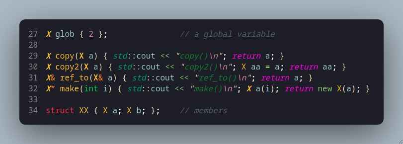

# Explanation of "Try This" on Page 742 of Stroustrup's PPP3
## A deep dive into C++ object semantics and other related topics such as assignment/initialization semantics, expression evaluation, memory allocation, and compile-time optimization.

On page 741 of "Programming: Principles and Practice Using C++ (3rd edition)" Bjarne Stroustrup provides this code for reflection. On page 742, he writes: "...run this example and try to explain the result. If you do, you’ll understand most of what there is to know about construction and destruction of objects." This document is my attempt to take his suggestion to heart. I break down the provided code into three sections and try to explain each line. In the third section I attempt to show what lines of "the result" correspond to the code in ```main()```. 

The code is broken up into three sections: 
1. [The ```X``` struct where the constructors are defined](#section-1----struct-x-and-the-essential-operations)
2. [A small section of global functions and the small ```XX``` struct](#section-2----a-few-global-things-and-xx)
3. [The ```main()``` function.](#section-3----main)

I will provide an image of the corresponding code at the head of each section, then -- where I find myself having to scroll up -- I provide an image of the corresponding lines before their explanation for reference. In the third section this gets perhaps a bit messy, where images of the corresponding lines of output ("the result") are provided _beneath_ the lines that produce them. An image of the total result output is provided at the very bottom of this document. [The source code for this file can be found here.](https://github.com/nantr0nic/cpp-learning/blob/main/bookwork/ppp3/chapter_17/scratchpads_drills_etc/try_this742.cpp) [A text document with the resulting output I'm analyzing can be found here.](https://github.com/nantr0nic/cpp-learning/blob/main/bookwork/ppp3/chapter_17/scratchpads_drills_etc/try_this_result_output.txt)

Lines 1 - 5 are missing, but they are a comment describing the file, three ```#include```'s (iostream, vector, and string) and a blank line. Other missing lines are omitted blank lines that in the source file to provide clarity/separation.

---

## Section 1 -- struct X and the essential operations


+ **Line 8:** This is a value that will help us keep track of constructions/copies/movement/etc.

+ **Line 10:** ```out()``` will print and provide the memory address, operation being called, current value and new value (in parentheses).

+ **Line 14:** ```X()``` is the **default constructor** -- it is "default" because it takes no parameters. If an X object is instantiated with only a name and no value, the default value of 0 will be assigned to ```val```. Example: ```X a;``` <-- an X object ```a``` will be default constructed with int ```val``` = 0 and ```out()``` will print X().

+ **Line 15:** ```X(int x)``` is a constructor that takes an int type as a parameter. If an X object is instantiated with an int, for example ```X a(3)```, then an X object ```a``` will be constructed with int ```val``` = 3 and ```out()``` will print X(int). This constructor could also be re-written (perhaps more idiomatically) with member-initialization like so:
```cpp
X(int x) : val{ x } { out("X(int) ", x); }
```


+ **Line 16:** ```X(const X& x)``` is a special constructor called a **copy constructor** that is called when an X object is initialized with a pre-existing X object as the parameter. The X object to be copied is passed as a constant reference, thus ensuring the original object is unmodified and is passed directly (via reference) to the constructor without an additional (in this case a _third_) copy being made. Example:
```cpp
X x1(3)     // First object
X x2{ x1 }; // x2 is copy constructed
```
In this code, ```out()``` will print X(X&), 0 (the current value of ```this```), x.val's int value in parentheses (this will be repeated in all ```out()``` prints). The val of ```this``` (the object being constructed) will be assigned the value of x's ```val```.
> **_Note_ =>** The copy _constructor_ is called for **new** objects. If (from our example) x2 already existed, then the copy _assignment operator_ would be called instead. Note also that in that case initialization brackets would fail to compile for a pre-existing object and the ```=``` operator would have to be used. This is a benefit of using initialization brackets because they are unambiguous, whereas ```=``` can be used for both, initialization and assignment. For example:
```cpp
X x1(3);
X x2{ x1 };     // initialized, copy constructed
X x3 = x2;      // initialized, copy constructed
x1 = x3;        // assignment, copy assignment operator
```


+ **Line 17:** ```X(X&& x)``` is a special constructor called a **move constructor** that is called when an **rvalue** is used to construct a new X object. The `&&` notation is called **rvalue reference** because it binds to values that appear on the right-hand side of expressions. Rvalues are expressions that represent temporary values or objects about to be destroyed -- this includes temporary objects returned by functions and objects wrapped in ```std::move()```.
```cpp
X function(int n) 
{
    X temp(n);
    temp.val += 1;
    return temp;
}
int main()
{
    X local_x{ function(4) };
    // local_x.val will be 5
}
```
> **_Note =>_** Modern compilers (mine included: Clang 20.1.7) often apply **Return Value Optimization (RVO)**(explained below) and can "eliminate the move constructor call entirely and instead construct the object directly in the caller's memory".

The move constructor will move ```val``` from ```temp``` directly to ```local_x``` as opposed to creating a complete X object ```temp```, then copy ```temp``` to ```local_x```, then delete ```temp```. Instead of creating the unnecessary copy of ```temp```, it moves the values of ```temp``` to the caller (in this case ```local_x```). While seemingly not a heavy operation in this example, the same would be applied to (for example) a vector of 100 elements of >16 character strings where the consequences of an unnecessary copy are more severe. This is explained in more detail below.
> **_Also!_** The move constructor (and the move assignment operator below) put the moved-from object into a "valid but unspecified state" when it sets that object to the default value of 0. The moved-from object is thus ready for destruction but can also be re-used -- it should not, however, be read from (in our code it will simply print zero but in other code it could perhaps be a nullptr or false value, etc.).

In our code, this constructor will have ```out()``` print X(X&&), set ```val``` (of ```this```) to x's ```val```, then set x's ```val``` to zero after moving is complete (preparing it for deletion).


+ **Line 18:** ```X& operator=(const X& x)``` is the **copy assignment operator**. It is an overload of the assignment operator that is called when assigning an existing object to another already existing object. For example:
```cpp
X object1(3);
X object2(5);
object1 = object2;    // object 2 is copied to object 1, thus object2.val = 5
```
It differs from a regular copy constructor by the pre-existence of the object that is being copied-to. Also, this is the first of our essential operations that takes a reference to the class type (X&) and returns a dereferenced ```this```. This allows for assignment chaining (as all built-in types allow), for example: ```xObject1 = xObject2 = xObject3 = X{ 5 };```. Also, returning by reference avoids creating temporary (unnecessary) copies as would be done if the copy assignment operator returned by value. In our code, ```out()``` prints "X copy assignment", the current value of ```this``` (which in this case may be non-zero since it is a pre-existing object!) and the new value being assigned to it.


+ **Line 21:** ```X& operator=(X&& x)``` is the **move assignment operator**. It is an overload of the assignment operator that is called when assigning an **rvalue** (temporary object or object wrapped in std::move()) to an **already existing** object. For example:
    ```cpp
    // Using X function(int n) from move constructor example
    int main()
    {
        X object3(5);
        object3 = function(6);    // Excluding RVO, this will call the move assignment operator because object3 already exists
    }
    ```
     ...or...
    ```cpp
    int main()
    {
        X object3(5);
        X object4(6);
        object4 = std::move(object3);
    }
    ```
The main difference between a move constructor and a move assignment operator is -- obviously -- the syntax but also the ability to chain assignment by virtue of the move assignment operator returning a dereferenced ```this```. 
> **_Note =>_** Construction (initialization) and assignment can both use the ```=``` syntax and can be a source of confusion. If the object is being _instantiated_ (that is, it does **not** already exist) then the ```=``` is initialization syntax and a **constructor** (either copy or move) will be called. If the object _already exists_ and is being modified, then the ```=``` is assignment syntax and an assignment operator (either copy or move) will be called. 


+ **Line 24:** ```~X()``` is (finally!) the **destructor**. It is called at the end of an object's lifecycle: local objects are destroyed when their scope ends; temporary objects are destroyed at the end of their full expression; dynamic objects are destroyed when ```delete``` is called; and static/global objects are destroyed at the end of the program (termination). For example:
```cpp
void function(int n)
{
    X temporary{ n };
} // <-- destructor is called for temporary here

X global{ 2 };

int main()
{
    X* dynamic = new X(5); 
    delete dynamic; // <-- destructor is called for xPtr here

    for (int i = 0; i < 3; ++i)
    {
        X local(i);
    } // <-- destructor is called for local here

    return 0; // <-- destructor is called for global here
}
```
Though not implemented in the code we are working with here, the destructor must release any resources that class objects obtain through their lifetime. If ```val``` was initialized on the heap, the destructor must include ```delete val;```, or if we have an Image object that opens an image file in its initialization, it must close that file stream in its destructor.

---
## Section 2 -- A few global things and XX


+ **Line 27:** This instantiates a global X object and initializes it with int value 2 therefore calling the int constructor from line 15. The corresponding line of output is here: 
  
  
+ **Line 29:** This defines a global/free function ```copy()``` that accepts an X object, creating a copy of it (pass-by-value), and then returns that same copy (return-by-value). Since we have defined a copy constructor on line 16, that constructor is invoked in the creation of the copied object in this function.
+ **Line 30:** A global/free function is like the line above it (pass-by-value), however here a temporary X object ```aa``` is instantiated and copy constructed from ```a``` then that temporary object is returned. Because the returned object is temporary, the compiler will call either the _move constructor_ if this function is used to initialize a new object, or the _move assignment operator_ if this function is used to set the value of a pre-existing X object in main().
+ **Line 31:** A global/free function that is pass- and return-by-reference. ```a``` must be a pre-existing X object and it is passed to this function by reference (a copy is not made); this function will return a reference to that same object. The returned reference can be used anywhere a reference to the original object would be valid. Thus, this function could be used in the following ways (note that since this functions returns a reference, this function can be used as an lvalue with an assignment operator):
```cpp
int main()
{
    X object1{ 5 };
    X& obj1Ref = ref_to(object1);
    obj1Ref.val += 1;

    X object2{ 3 };
    ref_to(object2) = object1;  // will call copy assignment operator, object2.val will now = 6

    ref_to(object1).member_function();  // pretend we have some member_function in our example

    int local_val = ref_to(object2).val;    // local_val will = 6
}
```
+ **Line 32:** ```make()``` is a global/free function that: 
  1. accepts an int parameter ```i``` (pass-by-value), 
  2. creates a local X object named ```a``` initialized with ```i``` using the int constructor from line 15, 
  3. then copy-constructs (line 16) a new heap-allocated X object from that temporary object, and finally 
  4. returns a pointer to that new X object.

This function allows us to make new X objects like so: ```X* object1 = make(4);``` rather than ```X* object1 = new X(4);```. While seemingly verbose for our simple X struct with a single int data member, such a function can prove useful with more complex classes where we want more control or instructions when creating heap-allocated objects (such as incrementing a global counter of heap objects). 

+ **Line 34:** Just a simple struct with two X objects as members. If an XX object is instantiated, members ```a``` and ```b``` will be default constructed (line 14).
---
## Section 3 -- main()

### For this section, I will include snippets of the output that correspond to the lines of code **_after_** they are explained. The output lines will be commented to show which lines they correspond to. The complete output is available at the end of the document. 
#### Note that this output is from a release compilation with -O2 and -DNDEBUG flags and may vary with other -O levels and will very most likely vary if debug compiled. And, of course, the output might vary if compiled with a different compiler (I'm using Clang 20).

+ **Line 38:** This instantiates a local (stack-allocated) X object named ```loc``` that is initialized with the int value 4 -- it will call the int constructor from line 15.

+ **Line 39:** This instantiates a local X object named ```loc2``` that is initialized by copy construction from ```loc``` -- it will call the copy constructor from line 16. ```loc2```'s ```val``` will take on the value of ```loc```'s ```val``` (at this point: 4).


+ **Line 41:** This will instantiate a temporary X object initialized with int 5 then the move assignment operator will be called to move that temporary object's data to ```loc```. Because ```loc``` already exists (assignment) and it is being assigned an rvalue (in this case a temporary object), the move assignment X&& operator (line 21) will be called.

> The comment on line 41 (copied correctly from the textbook) says this line should call the copy assignment operator, however, it does not. I am uncertain of why this discrepancy exists. Perhaps this part of the textbook was written pre-2011; this line would have indeed called the copy assignment operator before C++11.
>> _This is because move-construction and move-assignment semantics were introduced in C++11._ The && **rvalue reference** notation was introduced then and code like ```loc = X{ 5 };``` fell under the definition of move semantics because the _lvalue_ is a pre-existing object being assigned a temporary object in the expression's _rvalue_. One distinguishing feature of _moving_ from _copying_ is the data in the object moved-from is nullified (in our case, set to 0) and then discarded. The example in this code does not fully exemplify the difference between **moving** and **copying** because we are working with a single int value that the compiler might copy anyway because there is no performance benefit to moving such a small primitive. Imagine we have a function that returns a container (like vector) of 100 heap-allocated strings and in our main function we have ```existing_vector = our_function();```. With move semantics, instead of copying those 100 strings to ```existing_vector``` (resulting in the same 100 strings existing twice in memory) what happens instead is:
>>1. the pointer to the heap-allocated array is moved to ```existing_vector```
>>2. the pointer to that array from ```our_function()``` is set to ```nullptr```, and 
>>3. the size value (100) and the capacity value are copied to ```existing_vector``` and those values in the temporary container are set to 0.
>>
>>Thus, the 100 strings remain in place and the ownership of those 100 strings is moved to our ```existing_vector```. Roughly the same thing would happen for move-construction (where our vector did _not_ already exist), in that case the steps would include the initialization procedure for the vector we're defining. Also, it is worth noting that because of _Small String Optimization_, std::string would separately store the char values of long strings (often >16 characters) on the heap as well. Move operations operate on both levels, transferring ownership of the vector's internal array as well as the ownership of the character data for long strings.
>>> The copy assignment operator can however be forced by means of casting:
>>>```cpp
>>>loc = static_cast<const X&>(X{ 5 });
>>>```
>>> Then we can see the copy assignment operator being called:
>>>
>>>


+ **Line 42:** This will: 
  1. Call ```copy()``` with ```loc``` as the parameter, which will be passed-by-value, creating a local copy of ```loc``` by copy construction (line 7 of output)
  2. That local copy is then used to create a temporary object that is move-constructed from the local copy (line 9 of output) -- this temporary X object is returned by ```copy()```
  3. The temporary object (rvalue) is then move-assigned to ```loc2``` (line 10 of output)
> **_Note =>_** While move semantics is a significant improvement over pre-C++11 copy semantics, it is the case that "for decades", as Stroustrup writes, "compiler[s] can figure out how to do even better" (p. 733). This optimization occurs at any -O level and is called **copy elision** which includes _Return Value Optimization_ and _Named Return Value Optimization_ (among a few others but they don't pertain to our examples here). RVO became a prevalent but optional optimization in C++98/03. What RVO does is when the compiler encounters an object being constructed or assigned a function's returned temporary object (such as in our ```copy()```) the compiler can construct the return value directly in the memory space of that object being constructed/assigned -- thus eliminating unnecessary copies and instructions. If you execute this code and fail to see move-assignment, it might be the case that RVO has optimized away the move operation. When RVO is applied, no copying or moving occurs at all; when RVO is _not_ applied, move semantics provide a performative "fallback."

+ **Line 43:** This is similar to line 42 but in ```copy2()``` a second local X object is copy constructed from the parameter and that local object is then returned. In ```copy2()```:
  1. A local X object is copy constructed from passed-by-value ```loc``` (line 13 of output)
  2. Local X object named ```aa``` is copy constructed from the previous local object (line 15 of output)
  3. ```aa``` is returned and is move-assigned to ```loc2```
> **_Note =>_** A subtle difference here is that in ```copy2()```, ```aa``` is a _named_ local object within the scope of that function where, _without optimizations_, it would:
> 1. move-construct an expression-scoped **temporary** object: an _rvalue_ (Expression-scoped means, in this case, the expression ```loc2 = copy2(loc);```.)
> 2. that object would then be move-assigned to the lvalue ```loc2``` 
> 3. then that temporary object would be destructed. 
> 
> What we see here instead is an instance of **NRVO** -- the named ```aa``` was move-assigned directly to ```loc2``` rather than a temporary object being move-constructed from ```aa``` then _that_ object being move-assigned to ```loc2```. NRVO results in one less (unnecessary) object and fewer execution instructions -- NRVO results in only 1 operation as opposed to 3 without it. The performance difference can become quite significant (unlike for our single-int ```X``` objects) when the instructions for each operation (move-constructor, move-assignment, and destructor calls) involve large types with resource-heavy data members.
>> I admit I regret using the -O2 flag and would like to have written this document with a -O0 flag but I'm too far in (for now) to make this revision. I will attempt a second document explaining a -O0 compilation at a later time.


+ **Line 44:** This instantiates a local X object named ```loc3``` and initializes it with the int value 6 thus calling the int constructor.
  
+ **Line 45:** This line first calls ```ref_to()```, passing ```loc``` by reference, which returns a reference to the same X object (i.e. ```loc```). Then that reference is used to initialize the X reference ```r```, making ```r``` an alias for ```loc```. The code provided by the textbook doesn't print anything interesting for the reference initialization. Indeed, no constructors or assignment operators are called (the focus of this chapter); however, what we could have printed was ```&r``` and ```&loc``` to show they have the same memory address.
  


+ **Line 46:** This is an odd line because the function that allocates the memory to be deleted is itself being called by ```delete```. In any case, this line:
  1. First calls ```make()```, passing int value 7
  2. ```make()``` then creates a function-scoped, stack-allocated local X object named ```a``` that is initialized with the passed value (i.e. 7) -- thus calling X's int constructor (output line 22)
  3. Then, in ```make()```'s return... 
     1. ```new``` allocates 4 bytes of heap memory: large enough to fit X's single int data member -- the compiler determines this by calling ```sizeof(X)``` at runtime
     2. an X object is copy constructed from the local object ```a``` at that address (line 23)
     3. ```new``` returns a pointer to that memory address
  4. ```make()``` completes, returning the pointer to that (unnamed) heap-allocated X object -- it is at this point that the destructor for ```a``` is called (line 24)
  5. Finally, ```delete``` de-allocates the memory at the address of that pointer which calls that object's destructor (line 25). 
   >One interesting observation here is -- how does ```delete``` call the correct destructor when it is not deallocating a pointer that has a static type? I learned a key insight that **expressions** also have static types -- meaning, the compiler sees that ```make()``` returns a X*, thus the expression ```make(7)``` has static type ```X*```.Consequently, ```delete``` determines that ```~X()``` must be called when deallocating the memory address it is given.
   
+ **Line 47:** This will be identical to the previous line, except for the argument value being 8 instead of 7. 
  >What is worth noting is how the same stack _and heap_ memory addresses are being re-used for this second call of ```make()```. The function-scoped local object re-uses the same stack memory address (0x7ffc9903dabc) because stack memory is contiguous and not fragmented, respecting the "last in, first out" principle. As soon as that stack address is released, it is the address "at the top" and so is the next address to be used (again). This provides performance benefits that I'm unable to successfully describe. The heap address (0x5585effdd6c0) is reused here as well as for the next line when v's [0] element is heap-allocated. This also helps performance by inhibiting memory fragmentation and reducing system calls by lessening the need to request new/more memory from the operating system.
  


+ **Line 48:** This line initializes a vector named ```v``` with 4 X objects that are default constructed on the heap. Vector always stores its elements on the heap, and in this case it sequentially allocates 4 individual X objects default initialized to 0 (lines 31-34). Note the garbage data for ```v[0]```'s address (0x5585effdd6c0)-- this is the garbage data in that memory address following the ```delete``` instruction from the previous line.
  
+ **Line 49:** This line instantiates an ```XX``` object that is composed of two X objects ```a``` and ```b``` (code line 34) thus calling the default constructor for each (output lines 35-36).
  


+ **Line 50:** This line produces a heap-allocated X object initialized with the value 9 and then the pointer ```p``` is initialized with the memory address of that object (given by ```new```). It is similar to ```make()```, except the X object is directly constructed into memory rather than being copy constructed from a function-scoped local object. The order of instruction is:
  1. ```new``` allocates 4 bytes of heap memory (8 bytes on typical 64-bit)
  2. An X object is produced by the int constructor at that memory address
  3. ```new``` returns a pointer to that address
  4. Pointer ```p``` is initialized with the pointer returned by ```new```
However, in our output log, all we see is that ```X(int)``` is being called at a heap address (line 37).

+ **Line 51:** ```delete``` deallocates the memory address pointed at by ```p```, calling the destructor for the X object stored at that address (line 38).
  

  
+ **Line 52:** This line allocates an array of 5 X objects on the heap then initialized ```pp``` to point to (the first element of) that array. The order of instruction is similar to line 50 except that:
  1. ```new[]``` allocates **20** bytes of memory -- 5 contiguous blocks of 4 bytes each to fit the 5 X objects. The compiler determines the array size at compile time by "knowing" ```(5 * sizeof(X))``` and then (typically) stores that size as metadata at the address right before the first array element (the "header")
  2. Then the 5 X objects are sequentially produced via the default constructor (since no value is being passed) at those addresses
  3. ```new[]``` returns a pointer to the first element of the array (i.e. pp[0])
  4. ```pp``` is initialized with the pointer to the first element returned by ```new[]```
We can see by the value of the memory addresses that each block is indeed 4 bytes (output lines 39-43).

+ **Line 53:** ```delete[]``` deallocates the array pointed at by ```pp``` -- ```delete[]``` "knows" the array size but how so is implementation dependent. One typical implementation is ```delete[]``` reads from metadata stored by ```new[]``` and deallocates the corresponding memory addresses, calling ```~X()``` for each of those objects. Note the order of deallocation -- array elements are deallocated "last in, first out" just like stack memory. This is deallocation pattern is specified by C++.


+ **Line 55:** Finished! Here we will note a few observations about the order of destructors that are called at the program termination.
1. The destructors are called in "last in, first out"; thus, the most recently-constructed objects are destructed first and so on until lastly our long-ago initialized global object ```glob``` is destructed at output line 58. 
2. The objects are indeed destructed in the reverse order of their construction -- regardless if they are on the stack like ```a``` and ```b```, on the heap like the elements of ```v```, or in static memory like ```glob```. Do note that if we allocated an X object to the heap with ```new``` and did not call ```delete``` on it before the program is terminated (memory leak!), that memory is of course released at termination but its destructor will not be called.
3. Interestingly, the elements of ```v``` are deallocated/destructed in "first in, first out" order unlike the array elements of ```pp```. I am unsure why exactly this occurred. Some sources write that ```std::vector```'s elements are supposed to be destroyed in "last in, first out" order but it may be that Clang's -O2 optimizations changed the order that these were destroyed. Other sources claim that the order of destruction is implementation dependent... More investigation is required!


---
### Full Output

