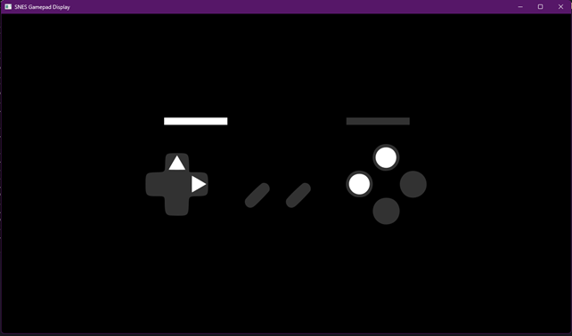

# SNES Gamepad Display

This is the very first sketch build of my new project that aims to display gamepad input for streamers. So far I've only tested it with SNES, so that is the name for now. I'm new to building with Visual Studio and haven't taken the time to setup .gitignore to filter out all the unnecessary files; so, I've just copied the binaries from out/ to bin/ and renamed the solution directory src/. 

> Contrary to the name of the folder, this (so far) actually does NOT use SDL as I initially expected it to -- only raylib through raylib-cpp.

### Please note
This is a work-in-progress by a self-taught C++ student! This is the alpha of alphas, if you will. While the code is simple and it seems to me there's nothing complex that should go wrong, please note that this is the beginning of a hobby project :)
